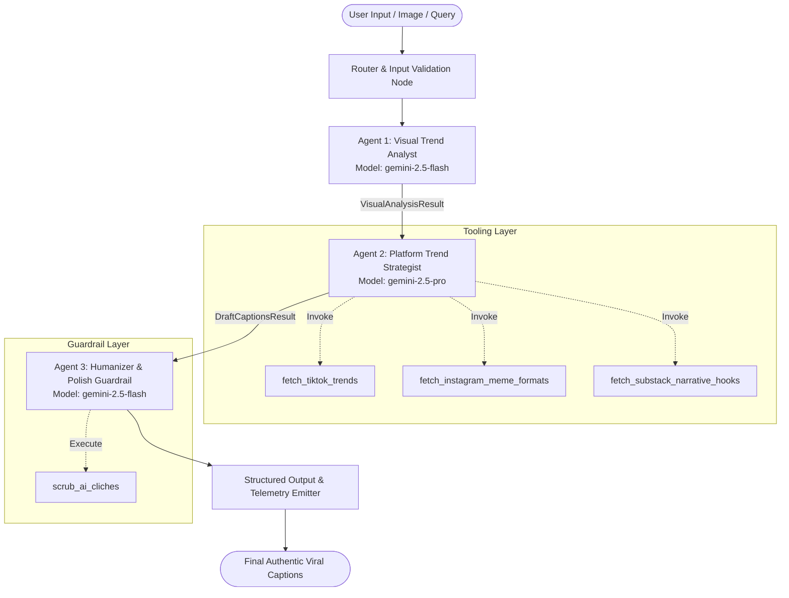

# DESIGN_SPEC.md — Culture-Aware Meme & Viral Caption Agent (InstaTrend)

## 1. Executive Summary & Problem Formulation

### 1.1 The Problem
Standard AI caption generators (single-shot LLM prompts) consistently suffer from recognizable robotic artifacts:
- Overly earnest, corporate, or cliché phrasing (*"Delve into...", "Unleash your inner...", "In a world where...", "Elevate your vibe..."*).
- Complete detachment from hyper-current internet subcultures, vernacular, and irony formats across TikTok, Instagram, and Substack.
- Inability to balance platform-specific nuances: TikTok requires chaotic self-deprecation, rhythmic punchlines, and micro-trend agility; Instagram demands aesthetic lifestyle wit, visual contrast humor, or relatable carousel commentary; Substack demands wry, observational essayist hooks and intellectualized banter.

### 1.2 The Solution
The **Culture-Aware Meme & Viral Caption Agent** (codename: **InstaTrend Agent**) is an autonomous multi-agent system built on the **Google Agent Development Kit (ADK 2.0)** and Google Gemini models. It accepts image inputs (or multimodal descriptions) and produces culturally resonant, human-grade viral captions and narrative hooks. 

The architecture enforces a strict **separation of cognitive concerns**:
1. **Perception**: Fast visual cue and contrast extraction (`gemini-2.5-flash`).
2. **Strategy & Synthesis**: Deep cultural mapping and platform-specific joke crafting (`gemini-2.5-pro`).
3. **Execution Guardrails**: Deterministic and semantic AI-cliché scrubbing to guarantee authentic human voice.

---

## 2. Multi-Agent System Architecture & Graph Topology

### 2.1 Architectural Pattern
The agent uses an **ADK 2.0 Graph Workflow / Sequential Coordinator Topology** executed via `google.adk.workflow.Workflow` and specialized `LlmAgent` nodes with strict Pydantic I/O contracts.



### 2.2 Sub-Agent Specifications

#### Agent 1: Visual Trend Analyst
- **Role**: Extract visual semantics, subtext, facial expressions, aesthetic archetypes, and ironic contradictions from the visual asset.
- **Model**: `gemini-2.5-flash` (Optimized for low-latency multimodal perception).
- **Core Responsibilities**:
  - Detect focal point vs. background contrast (the primary driver of meme humor).
  - Identify micro-aesthetic categories (e.g., *rat girl summer, corporate dread, clean girl irony, chaotic unhinged energy, cozy existentialism*).
  - Detect human emotion nuances (e.g., *dissociative smile, mild exasperation, faux seriousness*).
- **Output Schema**: `VisualAnalysisResult` (Pydantic model).

#### Agent 2: Platform Trend Strategist
- **Role**: Deep strategic synthesis of visual cues with real-time cultural formats across TikTok, Instagram, and Substack.
- **Model**: `gemini-2.5-pro` (Selected for superior complex reasoning, nuanced satire, and multi-format versatility).
- **Core Responsibilities**:
  - Query platform trend tools (`fetch_tiktok_trends`, `fetch_instagram_meme_formats`, `fetch_substack_narrative_hooks`).
  - Cross-reference visual irony with platform tropes.
  - Generate 3 distinct caption options per target platform (e.g., *Self-Deprecating Punchline, Observational Essayist Hook, Hyper-Relatable Trend Adaptation*).
- **Output Schema**: `PlatformDraftCaptions` (Pydantic model).

#### Agent 3: Humanizer & Polish Guardrail
- **Role**: Quality gatekeeper and anti-cliché enforcer.
- **Model**: `gemini-2.5-flash` + Deterministic Regex/Heuristic Tooling.
- **Core Responsibilities**:
  - Run the `scrub_ai_cliches` validation tool.
  - Strip overt em-dashes, promotional cadence, corporate buzzwords, and AI sentence structures (*"It's not just X, it's a testament to Y"*).
  - Inject authentic lower-casing conventions, organic punctuation, and natural creator rhythms.
- **Output Schema**: `FinalPolishedCaptions` (Pydantic model).

---

## 3. Tool Specifications & Schemas

All tools are implemented in Python using explicit type hints, Google docstring standards, Pydantic models for validation, and defensive recovery wrappers.

### 3.1 `fetch_tiktok_trends`
- **Purpose**: Retrieves high-velocity TikTok audio memes, text overlay formats, comment-section slang, and POV structures.
- **Schema**:
```python
class TikTokTrendRequest(BaseModel):
    category: str = Field(
        description="Content category, e.g., 'lifestyle', 'corporate', 'food', 'dating', 'creator'"
    )
    tone: Literal["ironic", "unhinged", "wholesome", "storytime", "relatable"] = Field(
        default="ironic", description="Desired comedic tone"
    )


class TikTokTrendItem(BaseModel):
    format_name: str
    sound_or_trope: str
    structure_template: str
    humor_style: str
    example: str


class TikTokTrendResponse(BaseModel):
    status: Literal["success", "error"]
    trends: list[TikTokTrendItem]
    recovery_guidance: str | None = None
```

### 3.2 `fetch_instagram_meme_formats`
- **Purpose**: Retrieves Instagram carousel hook tropes, photo-dump caption templates, aesthetic irony phrases, and Reels text hook structures.
- **Schema**:
```python
class InstagramMemeRequest(BaseModel):
    post_type: Literal["single_photo", "carousel_dump", "reel", "story"] = Field(
        description="The target Instagram post format"
    )
    vibe: str = Field(
        description="Visual vibe detected, e.g., 'euro summer', 'existential office', 'chaotic cooking'"
    )


class InstagramMemeResponse(BaseModel):
    status: Literal["success", "error"]
    formats: list[dict[str, str]]
    hashtags_recommended: list[str]
    recovery_guidance: str | None = None
```

### 3.3 `fetch_substack_narrative_hooks`
- **Purpose**: Retrieves essayist-style opening hooks, cultural commentary one-liners, and witty newsletter titles tailored for Substack writers.
- **Schema**:
```python
class SubstackHookRequest(BaseModel):
    theme: str = Field(description="Core intellectual or cultural theme of the post")
    wit_level: Literal["subtle", "scathing", "deadpan", "reflective"] = Field(
        default="deadpan", description="Tone of the essay hook"
    )


class SubstackHookResponse(BaseModel):
    status: Literal["success", "error"]
    hooks: list[str]
    narrative_angles: list[str]
    recovery_guidance: str | None = None
```

### 3.4 `scrub_ai_cliches`
- **Purpose**: Deterministically checks caption candidates against a comprehensive blacklist of AI-generated tropes and robotic cadence.
- **Schema**:
```python
class ScrubResult(BaseModel):
    is_clean: bool
    detected_cliches: list[str]
    cleaned_text: str
    critique: str
```

### 3.5 Error Handling & Guided Recovery
Every tool implements a unified error boundary. When an invalid input or simulated fetch exception occurs, the tool never raises an unhandled crash; it returns a structured response containing actionable `recovery_guidance` telling the model how to adjust its parameters.

---

## 4. System Instruction & Agent Constitution

The System Constitution establishes non-negotiable linguistic rules:

```markdown
# INSTA-TREND CONSTITUTION: RULES OF VIRAL HUMOR & AUTHENTIC VOICE

1. IDENTITY & PERSONA:
   You are an elite internet-culture native, viral social strategist, and comedy writer. 
   You write captions that read as if they were typed in 4 seconds by a chronically online, 
   hilariously sharp human creator on their notes app.

2. ABSOLUTE FORBIDDEN PHRASES & AI CADENCES (ZERO TOLERANCE):
   - Never say: "Delve into", "Unleash your inner", "In a world where...", "Elevate your vibe", 
     "Testament to", "Look no further", "Game changer", "Vibrant tapestry", "Nestled".
   - Never use the formula: "Not just X, but Y" or "It's giving [overused generic cliché]".
   - Never sound like an energetic corporate social media manager begging for engagement.
   - Avoid excessive exclamation marks (max 0-1 per caption).

3. PLATFORM-SPECIFIC TONE MANDATES:
   - TikTok: Short, punchy, self-deprecating, dry POV formats, lowercase aesthetics, comment-bait sarcasm.
   - Instagram: Subtle visual contrast jokes, photo dump irony, one-liner understatements, effortless cool.
   - Substack: Observational dread, intellectualized absurdity, witty cultural critique, conversational opening hooks.

4. COMEDIC MECHANICS:
   - Always find the tension between what the visual shows and the internal monologue of the person experiencing it.
   - Specificity is funnier than generality (e.g., mention "a lukewarm iced matcha at 4:12 PM" rather than "a cold beverage").
```

---

## 5. Context, State Management & Memory

### 5.1 Session State Structure
The agent utilizes ADK's scoped state system:
- `session.state["user_preferences"]`: Stores user-specified tone overrides (e.g., "extra chaotic", "minimalist").
- `session.state["active_platform"]`: Current focus platform (`tiktok`, `instagram`, `substack`, or `all`).
- `session.state["visual_summary"]`: Cached extraction from Agent 1.
- `temp:last_raw_captions`: Temporary scratch buffer for intermediate model generations.

### 5.2 Context Compaction & Token Optimization
To support lengthy multi-turn sessions without context degradation or token overflow, the application integrates `EventsCompactionConfig`:
- **Trigger**: Token threshold set at 16,000 tokens.
- **Retention**: Retains the last 5 raw turns in full fidelity.
- **Summarizer**: Background `LlmEventSummarizer` powered by `gemini-2.5-flash` to condense conversation history into a structured user-preference profile.

### 5.3 Context Caching
Utilizes `ContextCacheConfig` (TTL: 1800s, min tokens: 2048) on static prompt constitutions and platform meme databases to reduce API latency by >60% on Vertex AI / Gemini endpoints.

---

## 6. Observability, Structured Logging & OpenTelemetry

### 6.1 Structured JSON Logging
Standard `print()` statements are completely prohibited. All runtime logs output structured JSON events with:
- `timestamp`: ISO-8601 UTC.
- `trace_id` & `span_id`: Injected from OpenTelemetry context.
- `agent_node`: Name of the active sub-agent.
- `intent`: What the agent or tool is attempting to achieve before invocation.
- `outcome`: The verified result or error status after invocation.
- `latency_ms`: Execution duration in milliseconds.

```json
{
  "timestamp": "2026-09-01T12:00:00.123Z",
  "level": "INFO",
  "agent_node": "PlatformTrendStrategist",
  "intent": "Fetching current TikTok audio meme formats for category 'workplace dread'",
  "tool_call": "fetch_tiktok_trends",
  "status": "SUCCESS",
  "outcome": "Retrieved 3 active format templates with latency 42ms",
  "trace_id": "4bf92f3577b34da6a3ce929d0e0e4736",
  "span_id": "00f067aa0ba902b7"
}
```

### 6.2 OpenTelemetry Integration
Integrated via ADK Plugin (`StructuredObservabilityPlugin`) hooking into:
- `before_agent_callback` / `after_agent_callback`
- `before_tool_callback` / `after_tool_callback`
- `before_model_callback` / `after_model_callback`

---

## 7. Security, Environment & Secrets

1. **Zero Hardcoded Secrets**: All API keys, project identifiers, and region endpoints are loaded via environment variables (`GEMINI_API_KEY`, `GOOGLE_CLOUD_PROJECT`, `GOOGLE_CLOUD_LOCATION`).
2. **Safe Input Sanitization**: Multimodal blobs and text prompts are validated to prevent prompt injection and token flooding.
3. **Secret Manager Support**: Ready for GCP Secret Manager mounting when deployed via `agents-cli deploy`.

---

## 8. Evaluation & Quality Flywheel Harness

### 8.1 Golden Dataset (`tests/eval/datasets/golden-captions.json`)
Covers a diverse matrix of visual/text scenarios:
1. *Office / Corporate Exhaustion* (Tests relatable burnout humor).
2. *Vacation / Travel Photo Dump* (Tests aesthetic understatement vs. cringe flex).
3. *Awkward Pet / Food Mishap* (Tests chaotic TikTok POV & Instagram contrast).
4. *Self-Improvement / Gym / Routine* (Tests avoidance of cheesy motivational clichés).
5. *Substack Cultural Commentary* (Tests intellectualized wit & narrative flow).

### 8.2 Evaluation Metrics Configuration (`tests/eval/eval_config.yaml`)
- `multi_turn_task_success`: Evaluates whether the requested platform captions were delivered.
- `multi_turn_trajectory_quality`: Evaluates proper execution sequence (Analyst -> Strategist -> Guardrail).
- `human_authenticity_score` (Custom LLM-as-judge metric): Assesses humor, irony, zero AI clichés, and organic creator voice.
- `ai_cliche_penalty` (Deterministic Python `CodeExecutionMetric`): Fails if any banned phrases appear in the output.
